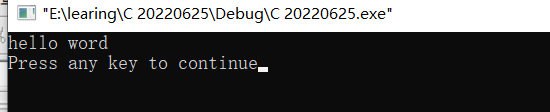
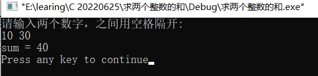
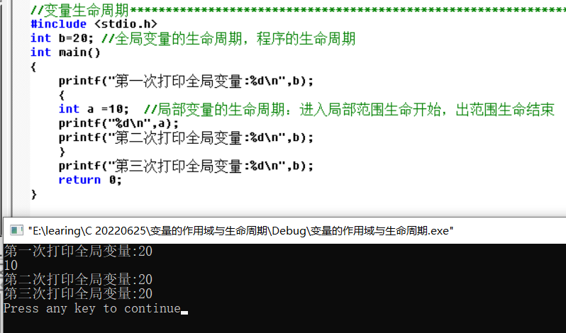
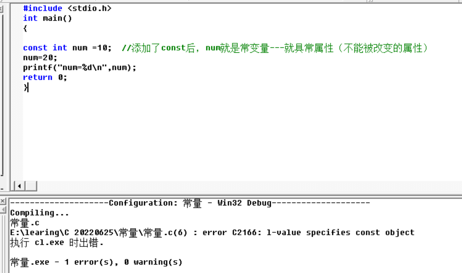
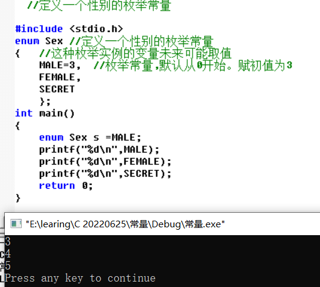

# C语言第一天

[Gitee地址](https://gitee.com/deng-yu-feng/c-language-learning)

[Github地址](https://github.com/deng-yu-feng/C-learing)

[CSDN地址](https://blog.csdn.net/weixin_54892866/category_11884696.html)

[TOC]


## 关于工程

- 一个工程只能有一个main函数
- 一个工程可以有多个.c文件

## 案例

### 1：一个简单的内容输出

```c
#include <stdio.h>  //引入头文件，编译预处理命令
int main()   //定义主函数
{            //函数开始的标志
    //printf为输出函数
	printf("hello word\n");  //输出的信息，/n为换行符                 
	return 0;    //函数执行完成返回函数值0
	getchar(); //暂停到代码运行界面
}            
```

运行结果：


### 2：数据类型

#### 1）数据类型解释

| 类型      | 解释         | 所占大小 | 案例                 |
| --------- | ------------ | -------- | -------------------- |
| char      | 字符数据类型 | 1        | char ch='a';         |
| short     | 短整型       | 2        | short num=10;        |
| int       | 整型         | 4        | int age = 20;        |
| long      | 长整型       | 4        |                      |
| long long | 更长的整型   | 8        |                      |
| float     | 单精度浮点数 | 4        | float weight = 50.5; |
| double    | 精度浮点数   | 8        | double d =0.0;       |

==printf("%d\n",100);  //打印一个整数---%d==
==sizefo--操作符--用来计算类型或者变量所占空间的大小，单位为字节==

`c语言标准：sizeof(long)>=sizeof(int)`

出现数据类型的原因？-----提高空间的利用率

**求数据类型的大小**

```c
#include <stdio.h>
int main()
{
	//printf("%d\n",100);  //打印一个整数---%d
	//sizefo--操作符--用来计算类型或者变量所占空间的大小，单位为字节
	printf("%d\n",sizeof(char));
	printf("%d\n",sizeof(short));
	printf("%d\n",sizeof(int));
	printf("%d\n",sizeof(long));
	printf("%d\n",sizeof(float));
	printf("%d\n",sizeof(double));  //查看数据类型所占的大小
	return 0;
}
```


#### 2）计算机中的单位

- 最小的为bit（比特位）

- byte--字节=8bit
- kb=1024byte
- mb=1024kb
- gb=1024mb

### 3：初识常量与变量

#### 1）描述

- 变量---能够被改变的量
- 常量---不能够被改变的量

#### 2）变量

#### （1）局部变量

```c
#include <stdio.h>
int main()
{
	int age = 20;   //创建一个变量；类型  变量的名字 = 数值
	double weight = 60.5; //创建一个体重的变量

	age=age+1;  //年龄+1
	weight=weight-5; //体重-5
	printf("%d\n",age);
	printf("%lf\n",weight);  //double打印使用%lf打印
	return 0;
}
```

#### （2）全局变量

```c
#include <stdio.h>
a = 20;  //全局变量
int main()
{
	int a = 10   //局部变量
	printf("%d\n",a);
	return 0;
}
//局部变量优先于全局变量
```

**局部变量与全局变量**
**{}内部为局部变量**
**{}外部为全局变量**
**当局部变量与全局与全局变量冲突的情况下，局部优先**

#### （3）计算两个数的和

```c
#include <stdio.h>
//scanf函数为输入函数

int main()
{
	int a=0;
	int b=0;
	int sum=0;
	printf("请输入两个数字，之间用空格隔开:\n");
	scanf("%d%d",&a,&b);
	sum=a+b;
	printf("sum = %d\n",sum);
	return 0;	
}
```

运行结果：

#### （4）变量的作用域与生命周期

##### a：作用域

`局部变量的作用域：就是变量所在的局部范围`	

```c
#include <stdio.h>
int main()
{
	//作用域与生命周期
	//作用域：即变量在哪里可以使用，就是变量的作用域
	{
		int a=10;
		printf("a=%d\n",a);  //只能在{}此区域内使用---局部变量的作用域：就是变量所在的局部范围
	}
	return 0;
}
```

`全局变量的作用域：整个工程`

```c

#include <stdio.h>
int g_val=2022;//全局变量的作用域：整个工程
int main()
{
	//作用域与生命周期
	//作用域：即变量在哪里可以使用，就是变量的作用域
	printf("第一次打印全局变量:%d\n",g_val);
	{
		int a=10;
		printf("a=%d\n",a);  //只能在{}此区域内使用---局部变量的作用域：就是变量所在的局部范围
	printf("第二次打印全局变量:%d\n",g_val);
	}
	printf("第三次打印全局变量:%d\n",g_val);
	return 0;
}
```

==**全局变量跨文件使用的声明**
**主函数前面声明：extern int 变量名**==

##### b：生命周期

`局部变量的生命周期：进入局部范围生命开始，出范围生命结束`

`全局变量的生命周期，程序的生命周期`

```c
//变量的生命周期
#include <stdio.h>
int b=20; //全局变量的生命周期，程序的生命周期
int main()
{
	printf("第一次打印全局变量:%d\n",b);
	{
	int a =10;  //局部变量的生命周期：进入局部范围生命开始，出范围生命结束
	printf("%d\n",a);
	printf("第二次打印全局变量:%d\n",b);
	}
	printf("第三次打印全局变量:%d\n",b);
	return 0;
}
```

运行结果



#### 3）常量

#### （1）常量的分类

##### a：字面常量

例如：3.14，2，a，abc

##### b：const修饰的常变量

```c
#include <stdio.h>
int main()
{

const int num =10;  //添加了const后，num就是常变量---就具常属性（不能被改变的属性）
num=20;
printf("num=%d\n",num);
return 0;
}
//运行会出现报错，其原因时const修饰的常变量不能被改变
```



##### c：#define定义的标识符常量

```c
#include <stdio.h>
#define MAX 10000
int main()
{
	//MAX=2000 //此写法为错误。#define定义的常量无法再次修改
	int n=MAX;
	printf("n=%d\n",n);
	return 0;
}
```

##### d：枚举常量

定义：可以一一列举的常量

```c
//定义一个性别的枚举常量
#include <stdio.h>
enum Sex //定义一个性别的枚举常量
{   //这种枚举实例的变量未来可能取值
	MALE=3,  //枚举常量,默认从0开始。赋初值为3
	FEMALE,
	SECRET
	};
int main()
{
	enum Sex s =MALE;
	printf("%d\n",MALE);
	printf("%d\n",FEMALE);
	printf("%d\n",SECRET);
	return 0;
}
```



