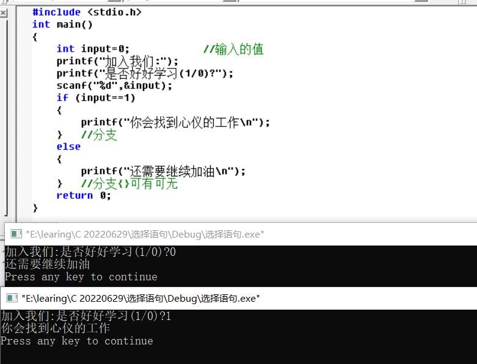
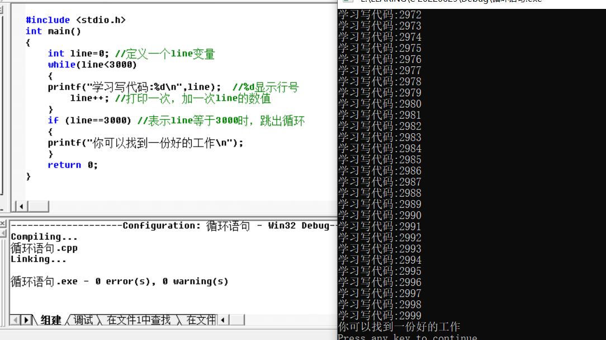
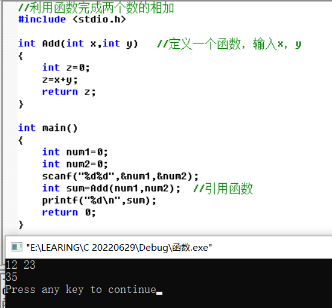
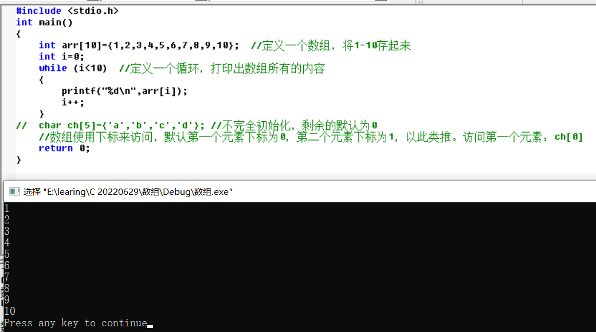
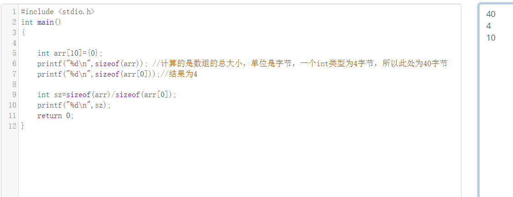
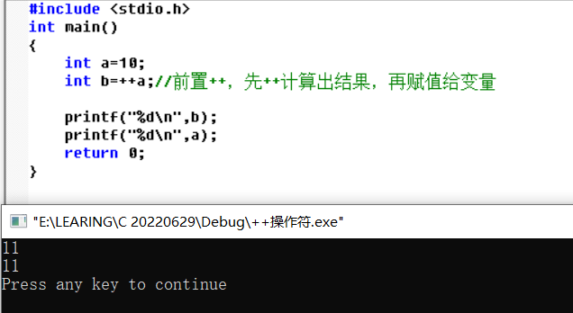

# C语言第三天

[Gitee地址](https://gitee.com/deng-yu-feng/c-language-learning)

[Github地址](https://github.com/deng-yu-feng/C-learing)

[CSDN地址](https://blog.csdn.net/weixin_54892866/category_11884696.html)

[TOC]

`时间顺流而下，生活逆水行舟`

## 选择语句

不同的选择对应不同的结果

```c
#include <stdio.h>
int main()
{
	int input=0;            //输入的值
	printf("加入我们:");
	printf("是否好好学习(1/0)?");
	scanf("%d",&input);
	if (input==1)
	{
		printf("你会找到心仪的工作\n");
	}   //分支
	else
	{
		printf("还需要继续加油\n");
	}   //分支{}可有可无
	return 0;
}
```

运行结果



## 初识循环语句（while）

需要进行重复性发生的事情

```c

#include <stdio.h>
int main()
{
	int line=0; //定义一个line变量
	while(line<3000)
	{
	printf("学习写代码:%d\n",line);  //%d显示行号
		line++; //打印一次，加一次line的数值
	}
	if (line==3000) //表示line等于3000时，跳出循环
	{
	printf("你可以找到一份好的工作\n");
	}
	return 0;
}
```



## 函数

可以重复调用

```c
//利用函数完成两个数的相加
#include <stdio.h>

int Add(int x,int y)   //定义一个函数，输入x，y
{
	int z=0;
	z=x+y;
	return z;
}
int main()
{
	int num1=0;
	int num2=0;
	scanf("%d%d",&num1,&num2);
	int sum=Add(num1,num2);  //引用函数
	printf("%d\n",sum);
	return 0;
}
```

运行结果



## 数组

定义：一组相同类型的元素的集合

`数组使用下标来访问，默认第一个元素下标为0，第二个元素下标为1，以此类推。 `

案例

```c
#include <stdio.h>
int main()
{
	int arr[10]={1,2,3,4,5,6,7,8,9,10};  //定义一个数组，将1-10存起来
	int i=0;
	while (i<10)  //定义一个循环，打印出数组所有的内容
	{
		printf("%d\n",arr[i]);
		i++;
	}
//	char ch[5]={'a','b','c','d'}; //不完全初始化，剩余的默认为0
	//数组使用下标来访问，默认第一个元素下标为0，第二个元素下标为1，以此类推。访问第一个元素：ch[0]
	return 0;
}
```

数组的运行结果



## 操作符

### 算数操作符

==+，-，* ，/，%==

- 对于/来说。想要得到一个为小数的值，需要使用float来定义，使用%f来打印，同时除数与被除数需要至少有一个为小数，例如 ：float a=9/2.0;即可得到结果为4.5

- ```c
  #include <stdio.h>
  int main()
  {
  	float a=9/2.0; //需要有一个数为小数。使用float类型
  	printf("%f\n",a);
  	return 0;
  }
  //运行结果为4.5
  ```

  

- %---取模（余），案例：int a=9%2;商4余1，所以结果为1

- ```c
  #include <stdio.h>
  int main()
  {
  	//float a=9/2.0; //需要有一个数为小数。使用float类型
  	int a=9%2;  //取模操作
  	printf("%d\n",a);
  	return 0;
  }
  ```

  

### 移位操作符

例如：>>--右移操作符，<<---左移操作符，移动的是二进制位

```c
#include <stdio.h>
int main()
{
//左移右移操作符
	int a=2;
	int b=a<<1;   //左移操作符，移动的是二进制位
	printf("%d\n",b);
	return 0;
}
//运行结果为4
```

### 位操作符

& ----按位与

| ----按位或

^  ---按位异或

### 赋值操作符

=，+=，-=，*=，/=,^=,|=,>>=,<<=

### 单目操作符

双目操作符：a+b，+有两个操作数。

单目操作符：只有一个操作数

==0表示假，非零表示真，将假变成真的时候，为1==

| 符号   | 含义                                         |
| ------ | -------------------------------------------- |
| ！     | 取反操作                                     |
| -      | 负值                                         |
| +      | 正值                                         |
| &      | 取地址                                       |
| sizeof | 操作数的类型长度（以字节为单位）             |
| ~      | 对一个数的二进制位按取反                     |
| --     | 前置，后置--                                 |
| ++     | 前置、后置++，先++得出结果，在赋值给变量使用 |
| *      | 间接访问操作符                               |
| (类型) | 强制类型转换                                 |

#### sizeof

```c
	#include <stdio.h>
int main()
{
	int a=10; //表示为真
	printf("%d\n",!a);  //!a取反，结果为0
/*用法    
    if(a)   //a为真的时候，执行下面的操作
    {
        
    }
    if(!a)   //a为假的时候，执行下面的操作
    {
        
    }
 */
	return 0;
}
```

`sizefo是一个操作符，计算类型或者变量的大小，也可以计算数组的大小，不是函数`

计算数组的大小

```c
#include <stdio.h>
int main()
{
//计算数组的大小
	int arr[10]={ 0 };
	int sz;
	printf("%d\n",sizeof(arr)); //计算的是数组的总大小，单位是字节，一个int类型为4字节，所以此处为40字节
	printf("%d\n",sizeof(arr[0]));//结果为4
	sz = sizeof(arr)/sizeof(arr[0]);
	printf("%d\n",sz);  //结果为10
	return 0;
}
```

运行结果



#### ~

==~按二进制位取反，把所有的二进制中数字，1变成0，0变成1==

数据在内存中存的是补码，一个整数的二进制表示有三种：原码，反码，补码

-1的  源码：10000000000000000000000000000001  符号位不变，其他位取反

​			反码：11111111111111111111111111111110

​			补码：11111111111111111111111111111111

正整数：原码，反码，补码相同

```c
#include <stdio.h>
int main()
{
	int a=0;
	printf("%d\n",~a); // 结果未-1，~按二进制位取反，把所有的二进制中数字，1变成0，0变成1
	return 0;
}
//运行结果-1
```

#### ++

==先++得出结果，在赋值给变量使用==

==后置++是先赋值给变量使用，再++==

```c
#include <stdio.h>
int main()
{
	int a=10;
	int b=++a;//前置++，先++计算出结果，再赋值给变量
	//后置++是先赋值给变量使用，再++
	printf("%d\n",b);
	printf("%d\n",a);
	return 0;
}
```



### 强制类型转换

```c

#include <stdio.h>
int main()
{
	int a=(int)3.14;  //强制将浮点型转化成整形，输出结果为3，不添加强制转换会出现警告，将会丢失精度
	printf("%d\n",a);
	return 0;
}
```

### 关系操作符

| 符号 | 含义     |
| ---- | -------- |
| >    | 大于     |
| <    | 小于     |
| >=   | 大于等于 |
| <=   | 小于等于 |
| !=   | 不等于   |
| ==   | 相等     |

### 逻辑操作符

&& 逻辑或

```c
#include <stdio.h>
int main()
{
	int a=3;
	int b=5;
	int c=a&&b;//即两边都为真的时候,结果为真，如果有一个为0，结果就为假
	printf("%d\n",c);  //输出结果为1真
	return 0;
}
```

|| 逻辑与

```c
#include <stdio.h>
int main()
{
	int a=3;
	int b=0;
	int d=a||b;//逻辑或，即一个为真的时候，结果就为真
	 printf("%d\n",d);//输出结果为1真
	return 0;
}
```

### 条件操作符

`exp1？exp2：exp3`

exp1成立，exp2计算，整个表达式的结构是：exp2的结果

exp1不成立，exp3计算，整个表达式的结构是：exp3的结果

```c
#include <stdio.h>
int main()
{
	int a=0;
	int b=3;
	int max=0;
/*	if(a>b)
		max=a;
	else
		max=b;
		*/  //可以写成max=a>b?a:b;
	max=a>b?a:b;
	printf("%d\n",max); //输出结果3
	return 0;
}
```

------

逗号表达式，逗号隔开的一段表达式

逗号表达式，是从左向右依次计算的，整个表达式的结果是最后一个表达式的结果

```c
#include <stdio.h>
int main()
{
		int a=0;
		int b=3;
		int c=5;
		int d=(a=b+2,c=a-4,b=c+2);
		//逗号表达式，是从左向右依次计算的，整个表达式的结果是最后一个表达式的结果
		printf("%d\n",d);  //结果为3
		return 0;
}
```

### 其他操作符

[3]：下标引用操作符，取数组的第三个参数

()：函数调用操作符，调用函数的时候，函数后面的（）就是函数调用的函数操作符