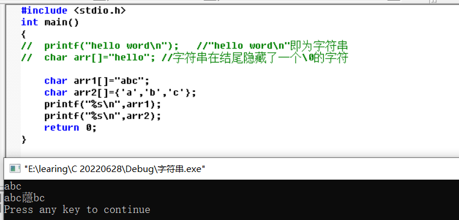
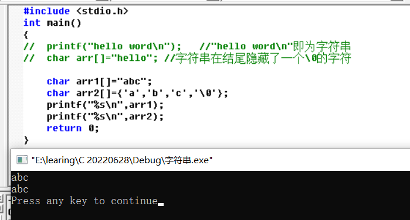
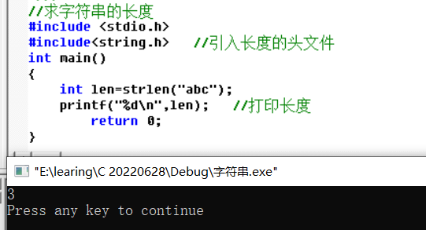
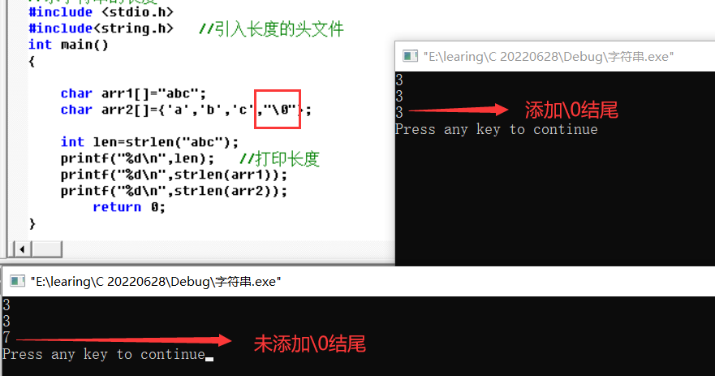
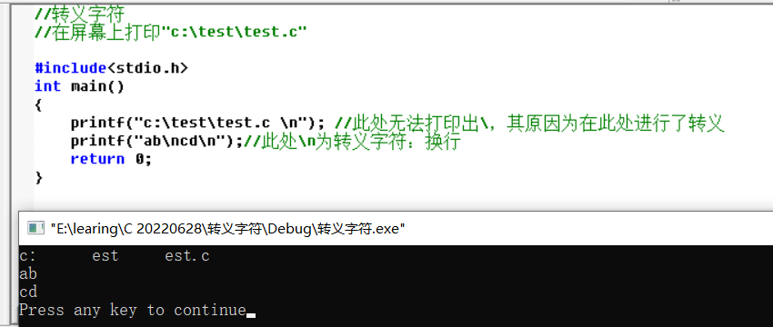
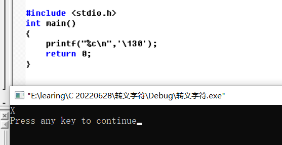

# C语言第二天

[Gitee地址](https://gitee.com/deng-yu-feng/c-language-learning)

[Github地址](https://github.com/deng-yu-feng/C-learing)

[CSDN地址](https://blog.csdn.net/weixin_54892866/category_11884696.html)

[TOC]

`没有人陪你走一辈子，所以你要适应孤独，没有人会帮你一辈子，所以你要一直奋斗`

## 字符串

### 1）字符串以\0结尾

字符串就是一串字符，用双引号括起来的一串

eg：“hello word\n”

```c
#include <stdio.h>
int main()
{
//	printf("hello word\n");   //"hello word\n"即为字符串
//	char arr[]="hello"; //字符串在结尾隐藏了一个\0的字符

	char arr1[]="abc";
	char arr2[]={'a','b','c'};
	printf("%s\n",arr1);
	printf("%s\n",arr2); 
	return 0;
} 
```

==字符串在结尾隐藏了一个\0的字符==

此时arr2出现乱码



手动在arr2的最后添加一个\0，再次运行，即可正常打印



### 2：求字符串的长度

```c
#include <stdio.h>
#include<string.h>   //引入长度的头文件
int main()
{
    int len=strlen("abc");
    printf("%d\n",len);
        return 0;
} 
```

==\0仅仅作为字符串的结束标志，在计算字符串的长度的时候不包含==

运行结果



```c
#include <stdio.h>
#include<string.h>   //引入长度的头文件
int main()
{

	char arr1[]="abc";
	char arr2[]={'a','b','c'};

    int len=strlen("abc");
    printf("%d\n",len);   //打印长度
	printf("%d\n",strlen(arr1));
	printf("%d\n",strlen(arr2));
        return 0;
} 
```

此时arr2的长度打印的结果为随机值，即找到以\0为结尾的标识符才停止，如果手动添加\0，运行结果则为3



## 转义字符

```c
//转义字符
//在屏幕上打印"c:\test\test.c"

#include<stdio.h>
int main()
{
	printf("c:\test\test.c");
	return 0;
}
```

打印结果



`无法打印出“\”，其原因是将“”识别成了转义字符`

`无法打印出“\n”是因为其具有特殊含义，表示换行`

```c
#include<stdio.h>
int main()
{
	printf("c:\\test\\test.c \n"); //此处无法打印出\，其原因为在此处进行了转义
	printf("ab\ncd\n");//此处\n为转义字符：换行
	printf("%s\n","\'");  //打印一个'
	return 0;
}
```


### 转义字符对应表

| 转义符号 | 含义                                           |
| -------- | ---------------------------------------------- |
| \?       | 在书写连续多个问号时使用，防止别解析成三字母词 |
| \ '      | 表示一个字符 常量'                             |
| \ "      | 表示一个字符内部的双引号                       |
| \ \      | 表示一个反斜杠，防止被解析成一个转义序列符     |
| \a       | 警告字符                                       |
| \b       | 退格符                                         |
| \f       | 进纸符                                         |
| \n       | 换行                                           |
| \r       | 回车                                           |
| \t       | 水平制表符                                     |
| \v       | 垂直制表符                                     |
| \ddd     | ddd表示1~3的八进制数字，如:\130x               |
| \xdd     | dd表示2个十六进制数字。如：\x30 0              |

==printf在打印的时候，可以指定打印的格式==

%d表示打印整形

%c表示打印字符

%s表示打印字符串

------

### 打印特殊转义字符

在ASCII中，每一个字符都有相对应的ASCII码值。根据值来确定字符

```c
#include <stdio.h>
int main()
{
	printf("%c\n",'\130'); //8进制的130是十进制的88,在ASCII中，X的ASCII码的值就为88
	printf("%c\n",'\101');
	return 0;
}
```

运行结果



### ASCII码值表

[ASCII码值地址](https://baike.baidu.com/item/ASCII/309296?fr=aladdin)

| Bin(二进制) | Oct(八进制) | Dec(十进制) | Hex(十六进制) | 缩写/字符                   | 解释         |
| ----------- | ----------- | ----------- | ------------- | --------------------------- | ------------ |
| 0000 0000   | 00          | 0           | 0x00          | NUL(null)                   | 空字符       |
| 0000 0001   | 01          | 1           | 0x01          | SOH(start of headline)      | 标题开始     |
| 0000 0010   | 02          | 2           | 0x02          | STX (start of text)         | 正文开始     |
| 0000 0011   | 03          | 3           | 0x03          | ETX (end of text)           | 正文结束     |
| 0000 0100   | 04          | 4           | 0x04          | EOT (end of transmission)   | 传输结束     |
| 0000 0101   | 05          | 5           | 0x05          | ENQ (enquiry)               | 请求         |
| 0000 0110   | 06          | 6           | 0x06          | ACK (acknowledge)           | 收到通知     |
| 0000 0111   | 07          | 7           | 0x07          | BEL (bell)                  | 响铃         |
| 0000 1000   | 010         | 8           | 0x08          | BS (backspace)              | 退格         |
| 0000 1001   | 011         | 9           | 0x09          | HT (horizontal tab)         | 水平制表符   |
| 0000 1010   | 012         | 10          | 0x0A          | LF (NL line feed, new line) | 换行键       |
| 0000 1011   | 013         | 11          | 0x0B          | VT (vertical tab)           | 垂直制表符   |
| 0000 1100   | 014         | 12          | 0x0C          | FF (NP form feed, new page) | 换页键       |
| 0000 1101   | 015         | 13          | 0x0D          | CR (carriage return)        | 回车键       |
| 0000 1110   | 016         | 14          | 0x0E          | SO (shift out)              | 不用切换     |
| 0000 1111   | 017         | 15          | 0x0F          | SI (shift in)               | 启用切换     |
| 0001 0000   | 020         | 16          | 0x10          | DLE (data link escape)      | 数据链路转义 |
| 0001 0001   | 021         | 17          | 0x11          | DC1 (device control 1)      | 设备控制1    |
| 0001 0010   | 022         | 18          | 0x12          | DC2 (device control 2)      | 设备控制2    |
| 0001 0011   | 023         | 19          | 0x13          | DC3 (device control 3)      | 设备控制3    |
| 0001 0100   | 024         | 20          | 0x14          | DC4 (device control 4)      | 设备控制4    |
| 0001 0101   | 025         | 21          | 0x15          | NAK (negative acknowledge)  | 拒绝接收     |
| 0001 0110   | 026         | 22          | 0x16          | SYN (synchronous idle)      | 同步空闲     |
| 0001 0111   | 027         | 23          | 0x17          | ETB (end of trans. block)   | 结束传输块   |
| 0001 1000   | 030         | 24          | 0x18          | CAN (cancel)                | 取消         |
| 0001 1001   | 031         | 25          | 0x19          | EM (end of medium)          | 媒介结束     |
| 0001 1010   | 032         | 26          | 0x1A          | SUB (substitute)            | 代替         |
| 0001 1011   | 033         | 27          | 0x1B          | ESC (escape)                | 换码(溢出)   |
| 0001 1100   | 034         | 28          | 0x1C          | FS (file separator)         | 文件分隔符   |
| 0001 1101   | 035         | 29          | 0x1D          | GS (group separator)        | 分组符       |
| 0001 1110   | 036         | 30          | 0x1E          | RS (record separator)       | 记录分隔符   |
| 0001 1111   | 037         | 31          | 0x1F          | US (unit separator)         | 单元分隔符   |
| 0010 0000   | 040         | 32          | 0x20          | (space)                     | 空格         |
| 0010 0001   | 041         | 33          | 0x21          | !                           | 叹号         |
| 0010 0010   | 042         | 34          | 0x22          | "                           | 双引号       |
| 0010 0011   | 043         | 35          | 0x23          | #                           | 井号         |
| 0010 0100   | 044         | 36          | 0x24          | $                           | 美元符       |
| 0010 0101   | 045         | 37          | 0x25          | %                           | 百分号       |
| 0010 0110   | 046         | 38          | 0x26          | &                           | 和号         |
| 0010 0111   | 047         | 39          | 0x27          | '                           | 闭单引号     |
| 0010 1000   | 050         | 40          | 0x28          | (                           | 开括号       |
| 0010 1001   | 051         | 41          | 0x29          | )                           | 闭括号       |
| 0010 1010   | 052         | 42          | 0x2A          | *                           | 星号         |
| 0010 1011   | 053         | 43          | 0x2B          | +                           | 加号         |
| 0010 1100   | 054         | 44          | 0x2C          | ,                           | 逗号         |
| 0010 1101   | 055         | 45          | 0x2D          | -                           | 减号/破折号  |
| 0010 1110   | 056         | 46          | 0x2E          | .                           | 句号         |
| 0010 1111   | 057         | 47          | 0x2F          | /                           | 斜杠         |
| 0011 0000   | 060         | 48          | 0x30          | 0                           | 字符0        |
| 0011 0001   | 061         | 49          | 0x31          | 1                           | 字符1        |
| 0011 0010   | 062         | 50          | 0x32          | 2                           | 字符2        |
| 0011 0011   | 063         | 51          | 0x33          | 3                           | 字符3        |
| 0011 0100   | 064         | 52          | 0x34          | 4                           | 字符4        |
| 0011 0101   | 065         | 53          | 0x35          | 5                           | 字符5        |
| 0011 0110   | 066         | 54          | 0x36          | 6                           | 字符6        |
| 0011 0111   | 067         | 55          | 0x37          | 7                           | 字符7        |
| 0011 1000   | 070         | 56          | 0x38          | 8                           | 字符8        |
| 0011 1001   | 071         | 57          | 0x39          | 9                           | 字符9        |
| 0011 1010   | 072         | 58          | 0x3A          | :                           | 冒号         |
| 0011 1011   | 073         | 59          | 0x3B          | ;                           | 分号         |
| 0011 1100   | 074         | 60          | 0x3C          | <                           | 小于         |
| 0011 1101   | 075         | 61          | 0x3D          | =                           | 等号         |
| 0011 1110   | 076         | 62          | 0x3E          | >                           | 大于         |
| 0011 1111   | 077         | 63          | 0x3F          | ?                           | 问号         |
| 0100 0000   | 0100        | 64          | 0x40          | @                           | 电子邮件符号 |
| 0100 0001   | 0101        | 65          | 0x41          | A                           | 大写字母A    |
| 0100 0010   | 0102        | 66          | 0x42          | B                           | 大写字母B    |
| 0100 0011   | 0103        | 67          | 0x43          | C                           | 大写字母C    |
| 0100 0100   | 0104        | 68          | 0x44          | D                           | 大写字母D    |
| 0100 0101   | 0105        | 69          | 0x45          | E                           | 大写字母E    |
| 0100 0110   | 0106        | 70          | 0x46          | F                           | 大写字母F    |
| 0100 0111   | 0107        | 71          | 0x47          | G                           | 大写字母G    |
| 0100 1000   | 0110        | 72          | 0x48          | H                           | 大写字母H    |
| 0100 1001   | 0111        | 73          | 0x49          | I                           | 大写字母I    |
| 01001010    | 0112        | 74          | 0x4A          | J                           | 大写字母J    |
| 0100 1011   | 0113        | 75          | 0x4B          | K                           | 大写字母K    |
| 0100 1100   | 0114        | 76          | 0x4C          | L                           | 大写字母L    |
| 0100 1101   | 0115        | 77          | 0x4D          | M                           | 大写字母M    |
| 0100 1110   | 0116        | 78          | 0x4E          | N                           | 大写字母N    |
| 0100 1111   | 0117        | 79          | 0x4F          | O                           | 大写字母O    |
| 0101 0000   | 0120        | 80          | 0x50          | P                           | 大写字母P    |
| 0101 0001   | 0121        | 81          | 0x51          | Q                           | 大写字母Q    |
| 0101 0010   | 0122        | 82          | 0x52          | R                           | 大写字母R    |
| 0101 0011   | 0123        | 83          | 0x53          | S                           | 大写字母S    |
| 0101 0100   | 0124        | 84          | 0x54          | T                           | 大写字母T    |
| 0101 0101   | 0125        | 85          | 0x55          | U                           | 大写字母U    |
| 0101 0110   | 0126        | 86          | 0x56          | V                           | 大写字母V    |
| 0101 0111   | 0127        | 87          | 0x57          | W                           | 大写字母W    |
| 0101 1000   | 0130        | 88          | 0x58          | X                           | 大写字母X    |
| 0101 1001   | 0131        | 89          | 0x59          | Y                           | 大写字母Y    |
| 0101 1010   | 0132        | 90          | 0x5A          | Z                           | 大写字母Z    |
| 0101 1011   | 0133        | 91          | 0x5B          | [                           | 开方括号     |
| 0101 1100   | 0134        | 92          | 0x5C          | \                           | 反斜杠       |
| 0101 1101   | 0135        | 93          | 0x5D          | ]                           | 闭方括号     |
| 0101 1110   | 0136        | 94          | 0x5E          | ^                           | 脱字符       |
| 0101 1111   | 0137        | 95          | 0x5F          | _                           | 下划线       |
| 0110 0000   | 0140        | 96          | 0x60          | `                           | 开单引号     |
| 0110 0001   | 0141        | 97          | 0x61          | a                           | 小写字母a    |
| 0110 0010   | 0142        | 98          | 0x62          | b                           | 小写字母b    |
| 0110 0011   | 0143        | 99          | 0x63          | c                           | 小写字母c    |
| 0110 0100   | 0144        | 100         | 0x64          | d                           | 小写字母d    |
| 0110 0101   | 0145        | 101         | 0x65          | e                           | 小写字母e    |
| 0110 0110   | 0146        | 102         | 0x66          | f                           | 小写字母f    |
| 0110 0111   | 0147        | 103         | 0x67          | g                           | 小写字母g    |
| 0110 1000   | 0150        | 104         | 0x68          | h                           | 小写字母h    |
| 0110 1001   | 0151        | 105         | 0x69          | i                           | 小写字母i    |
| 0110 1010   | 0152        | 106         | 0x6A          | j                           | 小写字母j    |
| 0110 1011   | 0153        | 107         | 0x6B          | k                           | 小写字母k    |
| 0110 1100   | 0154        | 108         | 0x6C          | l                           | 小写字母l    |
| 0110 1101   | 0155        | 109         | 0x6D          | m                           | 小写字母m    |
| 0110 1110   | 0156        | 110         | 0x6E          | n                           | 小写字母n    |
| 0110 1111   | 0157        | 111         | 0x6F          | o                           | 小写字母o    |
| 0111 0000   | 0160        | 112         | 0x70          | p                           | 小写字母p    |
| 0111 0001   | 0161        | 113         | 0x71          | q                           | 小写字母q    |
| 0111 0010   | 0162        | 114         | 0x72          | r                           | 小写字母r    |
| 0111 0011   | 0163        | 115         | 0x73          | s                           | 小写字母s    |
| 0111 0100   | 0164        | 116         | 0x74          | t                           | 小写字母t    |
| 0111 0101   | 0165        | 117         | 0x75          | u                           | 小写字母u    |
| 0111 0110   | 0166        | 118         | 0x76          | v                           | 小写字母v    |
| 0111 0111   | 0167        | 119         | 0x77          | w                           | 小写字母w    |
| 0111 1000   | 0170        | 120         | 0x78          | x                           | 小写字母x    |
| 0111 1001   | 0171        | 121         | 0x79          | y                           | 小写字母y    |
| 0111 1010   | 0172        | 122         | 0x7A          | z                           | 小写字母z    |
| 0111 1011   | 0173        | 123         | 0x7B          | {                           | 开花括号     |
| 0111 1100   | 0174        | 124         | 0x7C          | \|                          | 垂线         |
| 0111 1101   | 0175        | 125         | 0x7D          | }                           | 闭花括号     |
| 0111 1110   | 0176        | 126         | 0x7E          | ~                           | 波浪号       |
| 0111 1111   | 0177        | 127         | 0x7F          | DEL (delete)                | 删除         |

### 案例

求 ：printf("%d\n",strlen("c:\\test\\328\test.c "));   的长度

```c
//计算长度
#include <stdio.h>
#include <string.h>
int main()
{
	printf("%d\n",strlen("c:\test\328\test.c"));
	return 0;
}
```

`长度为14`，具体解释为："c",":","\t","e","s","t","\32","\8","\t","e","s","t",".","c"

==\32为一个八进制数字，八进制数字不包含8，所以\32为一个字符，8为另外一个字符==

## 注释

含义：用来解释复杂代码

注释方式

// ----当行注释，注释//所在行后的内容      ----c++的注释风格

/*   * /   c语言的注释风格，可以注释一整段代码，不支持嵌套注释，即不能在/*   */中在加入该注释