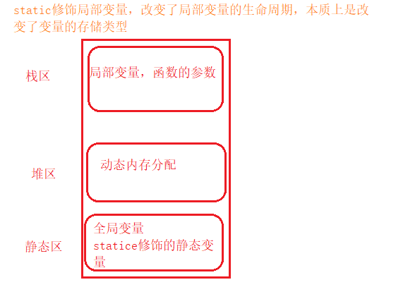

## 常见关键字

[Gitee地址](https://gitee.com/deng-yu-feng/c-language-learning)

[Github地址](https://github.com/deng-yu-feng/C-learing)

[CSDN地址](https://blog.csdn.net/weixin_54892866/category_11884696.html)

公众号：花期未到

[TOC]

## 1：常见关键字

关键字由c语言提供，不能作为变量

- auto 是自动的，每一个局部变量都是auto修饰的

- break，循环中断，中断整个循环

- char，修饰常变量，不能更改

- continue，中断当次循环

- default，默认

- do，while循环

- double，双精度

- enum，枚举

- extern，声明外部符号

- float，单精度浮点数

- for，循环

- goto ，语句

- register，寄存器关键字

  ```c
  	register int num = 100; //建议num的值存放在寄存器中
  ```

  在计算机中，数据可以存放到：寄存器>告诉高速缓存>内存>硬盘>网盘（造价越高，速度越快，空间越小）

  大量频繁被使用的数据，放在寄存器中，提升效率

- return，返回值

- short，短整型

- signed，有符号的 10  -20，unsigned无符号的

- sizeof，大小

- static，静态

- union，联合体（共用体）

- void 无（空）

define和include都不是关键字，都是预处理指令

## 2：常见关键字解释

### （1）typedef

类型重命名

```c
#include <stdio.h>
typedef unsigned int u_int
int main()
{
	unsigned int num = 0;
	u_int num2 = 0;  //两个变量的类型一致
	return 0;
}
```

### （2）static

#### a. static修饰局部变量

改变了局部变量的生命周期（本质上是改变了变量的存储类型）

```c
#include <stdio.h>
void test()
{
	// int a = 1;  //a是局部变量，进入时创建，离开时销毁，每次进入都会虫棍创建,结果为10个2
	static int a = 1   //结果为2-11，添加了static后，进入时创建变量，离开时变量不销毁
	a++;
	printf("%d",a);
}

int main()
{
	int i = 0;
	while (i<10)
	{
		test();
		i++;
	}
	return 0;
}
```



#### b.static修饰全局变量

`static修饰全局变量，是的这个全局变量只能在自己所在的源文件（.c）内部可以使用，其他文件不能使用`

```c
//static修饰全局变量
extern int g_val; //声明外部变量
#include <stdio.h>
int main()
{
	printf("%d\n",g_val);
	return 0;
}
```

```c
static int g_val = 2022; //static定义全局变量
```

两个文件需要在同一个工程中，此时，文件无法获取到通工程其他文件的变量

全局变量，在其他源文件内部可以被使用，是因为全局变量具有外部链接属性

但是全局变量被static修饰后，就变成了`内部链接属性`，其他源文件不能连接到这个静态的全局变量

#### c.static修饰函数

```c
#include <stdio.h>
extern int Add(int x, int y);   //声明函数
int main()
{
	int a = 10;
	int b = 20;
	int sum = Add(a,b)
	printf("sum = %d\n",sum);
	retuen 0;
}
```

```c
static int Add(int x, int y)  //定义全局函数，使用static进行修饰
{
	return x + y;
}
```

两个文件需要在同一个工程中


static修饰函数，使得函数只能在自己所在的源文件内部使用，不能在其他源文件内部使用

本质上：static是讲函数的外部连接属性变成了内部连接属性（与static修饰全局变量一致）

## 3：define 定义变量和宏

define是一个预处理指令

### （1）define定义符号

```c
#define MAX 1000   //define定义符号
```

```c
#include <stdio.h>
#define MAX 1000   //define定义符号
 int main ()
{
	printf("%d\n",MAX);
	return 0;
}
```

### （2）define定义宏

```c
//define定义宏
#define ADD(X,Y) ((X)+(Y))  //对于x，y可能是特殊字符，需要使用()包括起来，对于整个宏，也要使用（）将整个宏括起来
int main()
{
	printf("%d\n",4*ADD(2,3));  //计算结果为20
	return 0;
}
```

